# VulkanAutomata
GPU-Accelerated Cellular Automata Render Engine using the Vulkan API

Developed on `Xubuntu 20.04`

---

The Cellular Automata 'rules' are coded as Fragment Shaders in `./res/frag/` 
 
Shaders are compiled from `./res/vert/` and  `./res/frag/` using the program `glslc`

`glslc` is found in the Vulkan SDK at `/x86_64/bin/glslc`

The Vulkan SDK can be found at: https://vulkan.lunarg.com/sdk/home

---

Commands should be called from the location `./VulkanAutomata`

Build & Run:

`script_buildrun.sh`

---

Contacts & Networking:

  https://twitter.com/slackermanz

  https://www.reddit.com/user/slackermanz/

  https://www.youtube.com/channel/UCmoNsNuM0M9VsIXfm2cHPiA/videos

  https://www.shadertoy.com/user/SlackermanzCA

  https://discord.gg/BCuYCEn

---

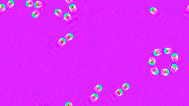
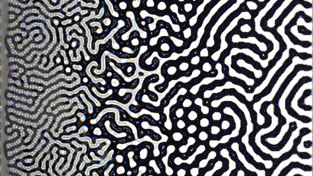
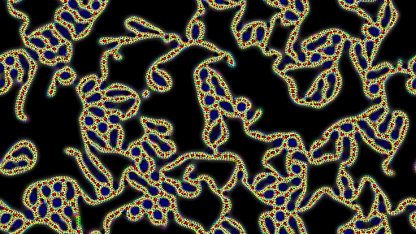

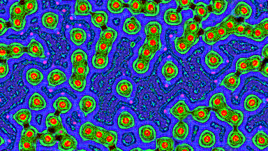
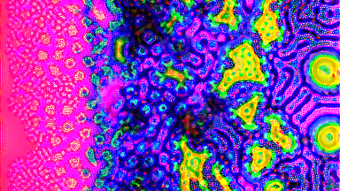
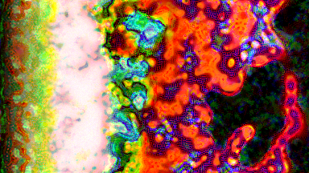

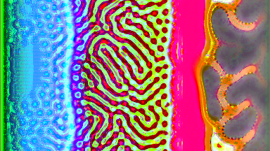

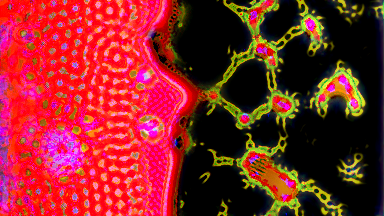

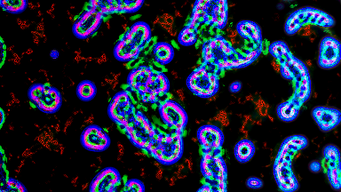
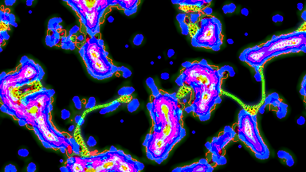
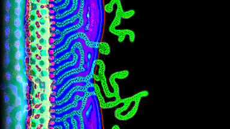
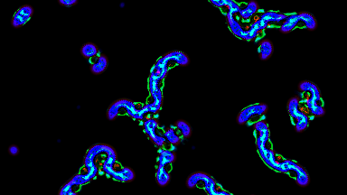
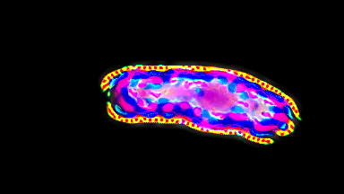
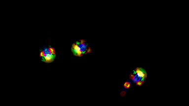
